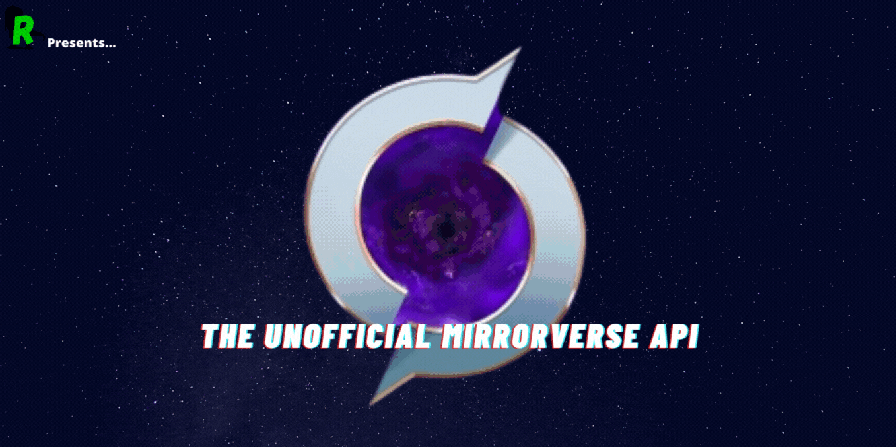

    <h1>UMVA (Unofficial MirrorVerse API)</h1>
  

    
    
  

## Overview

UMVA is a API created for the developers who like and play DMV(Disney MirrorVerse).
It currently gives information about the guardian's stats, abilities, talents and other info.

## URI

The base URI for the API is- `https://api.umva.tk/` and all the requests are to be made on this.

## Documentation

To get more information about the endpoints, check out our documentation:
[Docs](https://docs.umva.tk/)